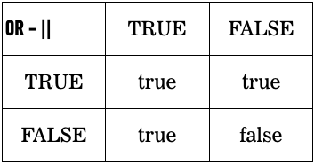
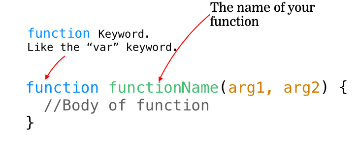

# JavaScript

## Conditions, Functions, and Arrays

Evan Johnson + Derek Fons

---

## Agenda

* <!--- .element: class="fragment" data-fragment-index="1" -->Review
* <!--- .element: class="fragment" data-fragment-index="2" -->Conditions
* <!--- .element: class="fragment" data-fragment-index="3" -->Lab
* <!--- .element: class="fragment" data-fragment-index="4" -->Functions
* <!--- .element: class="fragment" data-fragment-index="5" -->Code Along
* <!--- .element: class="fragment" data-fragment-index="6" -->Arrays
* <!--- .element: class="fragment" data-fragment-index="7" -->Code Along
* <!--- .element: class="fragment" data-fragment-index="8" -->Lab
* <!--- .element: class="fragment" data-fragment-index="9" -->Closing

---

## Learning Objectives

* <!--- .element: class="fragment" data-fragment-index="1" -->Write an IF/ELSE condition
* <!--- .element: class="fragment" data-fragment-index="2" -->Describe how to write a function
* <!--- .element: class="fragment" data-fragment-index="3" -->Write a Function that accepts 3 parameters

---

## Review

----

### jQuery Selectors Challenge

How did it go?

----

### Startup MatchMaker

How did it go?

---

## Conditions

----

###Conditional Syntax

```
if (condition is true) {  
  // Do cool stuff
}
```

----

###Conditional Syntax

```
if (condition is true) {
  // Do cool stuff
} else {
  // Do other cool stuff
}	
```

----

###Conditional Syntax

<pre><code data-trim class="javascript" contenteditable>
var topic = "JS";

if (topic == "JS") {
  console.log("You're learning JavaScript");
} else if (topic == "JavaScript") {
  console.log("You're still learning JavaScript");
} else {
  console.log("You're learning something else");
}
</code></pre>

----

###Multiple Conditions

You can check multiple conditions by using the AND (**&&**) or the OR (**||**) operators.

<pre><!--- .element: class="fragment" data-fragment-index="1" --><code data-trim class="javascript">
if (name == "GA" && password == "YellowPencil") {
  // Allow access to internet
}

if (day == "Tuesday" || day == "Thursday"){
  // We have class today
}
</code></pre>

----

###The Truth Table

AND operator:

<pre><!--- .element: class="fragment" data-fragment-index="1" --><code data-trim class="javascript">
if (name == "GA" && password == "YellowPencil") {
	// Allow access to internet
}
</code></pre>

----

###The Truth Table


----

###The Truth Table

OR operator:

<pre><!--- .element: class="fragment" data-fragment-index="1" --><code data-trim class="javascript">
if (day == "Tuesday" || day == "Thursday") {
	// We have class today
}
</code></pre>

----

###The Truth Table




----

### Lab

SEA-FEWD5: Week_05_JS_ComputerScience/
09_variables_conditionals/starter_code


---

## Functions

----

### Functions Syntax



----

### Function Calls


----

### Function Arguments


----

### Function Arguments


----

### Return Functions

----

###Organizing Function 

Where do you put functions

----

### Code Along

SEA-FEWD5: /Week_05_JS_ComputerScience/
10_functions/starter_code/cash_register


----

### Anonymous Functions

---

## Closing

----

### Learning Objectives

* <!--- .element: class="fragment" data-fragment-index="1" -->Write an IF/ELSE condition
* <!--- .element: class="fragment" data-fragment-index="2" -->Describe how to write a function
* <!--- .element: class="fragment" data-fragment-index="3" -->Write a Function that accepts 3 parameters

----

### Final Project

----

### Exit Tickets

Give us feedback! Let us know what we're doing well at, and more
importantly, what we can improve at.
